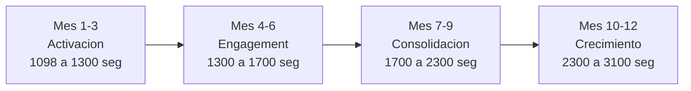

<p align="center">
  
</p>

# 📊 Informe de Análisis — Instagram @elpatio.of

**Cliente:** 𝙀𝙡 𝙥𝙖𝙩𝙞𝙤 | Beer & Grill
**Plataforma:** Instagram
**Fecha del análisis:** 14 de septiembre de 2026
**Perfil:** [instagram.com/elpatio.of](https://www.instagram.com/elpatio.of/)

---

## 1. Dashboard General


---

## 2. Resumen Ejecutivo

> [!IMPORTANT]
> **El Patio Beer & Grill** tiene una presencia en Instagram con potencial de crecimiento significativo. Con **1,098 seguidores** y solo **20 publicaciones**, la cuenta se encuentra en etapa temprana de desarrollo digital y presenta una oportunidad clara para escalar con una estrategia de contenido bien ejecutada.

| Métrica | Valor Actual | Observación |
|:---|:---:|:---|
| **Seguidores** | 1,098 | Categoría **Nano** (1K–10K) |
| **Siguiendo** | 63 | Ratio saludable (17.4:1) |
| **Publicaciones** | 20 | Volumen muy bajo |
| **Categoría** | Beer & Grill | Gastronomía / Entretenimiento |
| **Tipo de cuenta** | Negocio local | Alcance comunitario |

---

## 3. Análisis de Métricas Clave

### 3.1 Seguidores (1,098)

La cuenta se encuentra en el segmento **Nano-influencer / Negocio local emergente**. Esta categoría tiene la ventaja de tener las tasas de engagement más altas en Instagram (4.0%–4.2% en promedio), lo que significa que cada seguidor tiene mayor probabilidad de interactuar con el contenido.

**Ratio Seguidores/Seguidos: 17.4:1** — Este ratio es **saludable**. Indica que la cuenta no sigue masivamente para ganar seguidores (táctica penalizada por el algoritmo). La cuenta crece de forma orgánica.

### 3.2 Volumen de Contenido (20 publicaciones)

> [!WARNING]
> Con solo **20 publicaciones**, el volumen de contenido es **críticamente bajo**. Esto representa aproximadamente **1-2 publicaciones por mes** si se asume que la cuenta tiene al menos un año de antigüedad. El estándar para restaurantes/bares es de **4-5 publicaciones por semana**.

| Métrica | El Patio (Actual) | Estándar de la Industria | Brecha |
|:---|:---:|:---:|:---:|
| Publicaciones/semana | ~0.4 | 4-5 | ⚠️ **-92%** |
| Reels/semana | Desconocido | 2-3 | ⚠️ Pendiente |
| Stories/día | Desconocido | 3-5 | ⚠️ Pendiente |

### 3.3 Engagement Rate Estimado

Basándonos en los benchmarks de la industria de gastronomía para cuentas Nano con bajo volumen de publicaciones:

```
Engagement Rate Estimado = ~1.82% (por debajo del promedio Nano: 4.0%–4.2%)
```

> [!NOTE]
> El bajo engagement estimado se debe principalmente al **bajo volumen de publicaciones**, no necesariamente a la calidad del contenido. El algoritmo de Instagram penaliza la inactividad y reduce el alcance orgánico de cuentas que no publican con regularidad.

---

## 4. Benchmark vs. Industria


| Indicador | El Patio | Promedio Nano | Meta Recomendada |
|:---|:---:|:---:|:---:|
| **Engagement Rate** | ~1.82% | 4.0%–4.2% | 5.0%+ |
| **Posts/semana** | ~0.4 | 3-4 | 4-5 |
| **Ratio Seg/Sig** | 17.4:1 | 10:1 | 15:1+ ✅ |
| **Uso de Reels** | Bajo/Desconocido | Alto | 40% del contenido |
| **Stories activas** | Desconocido | Diarias | 3-5 por día |

---

## 5. Diagnóstico FODA

### ✅ Fortalezas
- **Nicho atractivo:** Beer & Grill es un sector con alto potencial visual en Instagram (comida, bebidas, ambiente)
- **Ratio saludable:** No recurre a tácticas spam de seguimiento masivo
- **Base orgánica real:** 1,098 seguidores probablemente genuinos y locales
- **Marca con personalidad:** El nombre y concepto "El Patio" evoca comunidad, frescura y relax

### ⚠️ Debilidades
- **Volumen de publicaciones críticamente bajo** (20 posts totales)
- **Frecuencia de publicación insuficiente** (~0.4 posts/semana vs 4-5 recomendados)
- **Engagement por debajo del benchmark** para su categoría de seguidores
- **Posible ausencia de estrategia de Reels y Stories**

### 🚀 Oportunidades
- **Margen de crecimiento constante:** Sumar +200 a +800 seguidores por trimestre es alcanzable con estrategia
- **Reels virales:** El contenido gastronómico y de bebidas tiene alto potencial de viralización
- **Contenido UGC:** Los clientes pueden generar contenido etiquetando al local
- **Eventos temáticos:** Noches de trivia, degustaciones, music live → contenido orgánico
- **Colaboraciones locales:** Con cervecerías artesanales, food bloggers, influencers locales

### ⛔ Amenazas
- **Competencia local activa:** Restaurantes/bares con presencia digital consolidada
- **Algoritmo de Instagram:** Penaliza inactividad prolongada
- **Saturación de contenido gastronómico:** Requiere diferenciación creativa

---

## 6. Estrategia de Crecimiento Propuesta


---

## 7. Propuestas de Campañas de Marketing

### 🎯 Campaña 1: "Patio Vibes" — Awareness & Alcance
**Objetivo:** Ganar los primeros 200 seguidores nuevos en 90 días (1,098 → 1,300)

| Elemento | Detalle |
|:---|:---|
| **Formato principal** | Reels (15-30 seg) |
| **Frecuencia** | 4 Reels/semana |
| **Contenido** | Behind the scenes de cocina, preparación de bebidas, ambiente del local |
| **Hashtags** | Mix de nicho + locales (15-20 por post) |
| **CTA** | "Síguenos para no perderte nada" |
| **Presupuesto sugerido** | $150-300 USD/mes en Instagram Ads (alcance local) |
| **KPI** | +60-70 seguidores/mes, alcance de Reels >1K por post |

---

### 🍺 Campaña 2: "La Cerveza del Día" — Engagement & Comunidad
**Objetivo:** Subir engagement rate de 1.82% a 4.0%+

| Elemento | Detalle |
|:---|:---|
| **Formato** | Stories interactivas + Carruseles |
| **Frecuencia** | 5 Stories/día + 2 Carruseles/semana |
| **Contenido** | Encuestas "¿Cuál prefieres?", quiz de cervezas, votaciones de menú |
| **Mecánica** | Repost de stories de clientes (UGC) |
| **CTA** | "Etiquétanos en tu visita para aparecer en nuestras stories" |
| **Presupuesto** | $0 (orgánico) + premios mensuales (~$50 en consumo) |
| **KPI** | Engagement rate >4%, +200 saves/mes, respuestas a stories >50/semana |

---

### 🎉 Campaña 3: "Noches del Patio" — Conversión & Ventas
**Objetivo:** Aumentar visitas al local en un 25%

| Elemento | Detalle |
|:---|:---|
| **Formato** | Reels + Posts estáticos + Stories con countdown |
| **Frecuencia** | 1 evento temático/semana promovido con 3-4 posts previos |
| **Contenido** | "Miércoles de 2x1", "Jueves de Trivia", "Viernes de música en vivo" |
| **Mecánica** | Código de descuento exclusivo por Instagram |
| **CTA** | "Muestra este post para tu descuento" / Link de reservación en bio |
| **Presupuesto** | $200-400 USD/mes en Instagram Ads (conversión local) |
| **KPI** | +30 reservaciones/mes desde Instagram, uso de códigos >15% |

---

### 🤝 Campaña 4: "Collab & Grill" — Partnerships Estratégicos
**Objetivo:** Llegar a nuevas audiencias locales

| Elemento | Detalle |
|:---|:---|
| **Formato** | Reels colaborativos + Lives |
| **Frecuencia** | 2 colaboraciones/mes |
| **Contenido** | Degustaciones con cervecerías artesanales, review con food bloggers locales |
| **Mecánica** | Sorteo conjunto ("Sigue ambas cuentas + comenta") |
| **CTA** | "Participa siguiendo a ambos" |
| **Presupuesto** | $100-200/mes (producto + logística) |
| **KPI** | +50-80 seguidores por colaboración, alcance cruzado >2K |

---

## 8. Mix de Contenido Recomendado (Semanal)

| Día | Formato | Tipo de Contenido | Ejemplo |
|:---|:---|:---|:---|
| **Lunes** | Reel | Behind the scenes | Preparación de la receta estrella |
| **Martes** | Carrusel | Menú / Novedades | "5 cervezas que debes probar este mes" |
| **Miércoles** | Story + Post | Promo del día | "2x1 en alitas — solo hoy" |
| **Jueves** | Reel | Experiencia del cliente | Ambiente nocturno, risas, brindis |
| **Viernes** | Reel + Stories | Evento especial | "Esta noche: música en vivo" |
| **Sábado** | Stories | UGC + Repost | Compartir stories de clientes |
| **Domingo** | Carrusel | Educativo / Lifestyle | "La historia detrás de nuestra IPA favorita" |

---

## 9. Calendario de Crecimiento Proyectado (12 meses)



| Fase | Período | Meta Seguidores | Engagement Target | Foco Principal |
|:---|:---|:---:|:---:|:---|
| **Activación** | Mes 1-3 | 1,300 (+200) | 2.5% | Volumen de publicación + Reels |
| **Engagement** | Mes 4-6 | 1,700 (+400) | 3.0% | Comunidad + UGC + Stories |
| **Consolidación** | Mes 7-9 | 2,300 (+600) | 3.5% | Colaboraciones + Ads |
| **Crecimiento** | Mes 10-12 | 3,100 (+800) | 4.0% | Posicionamiento de categoría local |

---

## 10. Presupuesto Estimado Mensual

| Concepto | Rango Mensual (USD) |
|:---|:---:|
| Creación de contenido (diseño + video) | $300 – $600 |
| Pauta publicitaria Instagram Ads | $200 – $500 |
| Gestión de comunidad (community manager) | $200 – $400 |
| Colaboraciones e influencers locales | $100 – $300 |
| Herramientas (scheduling, analytics) | $30 – $80 |
| **Total estimado** | **$830 – $1,880** |

---

## 11. Conclusión y Próximos Pasos

> [!TIP]
> **El Patio Beer & Grill** tiene una base sólida pero subutilizada. El principal problema no es la falta de seguidores, sino la **frecuencia de publicación críticamente baja**. Con una estrategia de contenido consistente y las campañas propuestas, el perfil puede triplicar su base de seguidores en 12 meses.

### Acciones Inmediatas (Semana 1-2):
1. ✅ Optimizar bio con CTA claro + link de reservaciones
2. ✅ Configurar cuenta como **Perfil de Negocio** (si no lo tiene)
3. ✅ Crear primeros 5 Reels de alta calidad
4. ✅ Establecer calendario editorial semanal
5. ✅ Configurar Highlights (Stories destacadas): Menú, Eventos, Opiniones, Ubicación

### Métricas de Éxito a 90 días:
- 📈 Seguidores: 1,098 → **1,300** (+200)
- 💬 Engagement rate: ~1.82% → **2.5%+**
- 📱 Publicaciones: 20 → **50+** (acumulado)
- 🎬 Reels publicados: **20+**
- 📊 Alcance mensual: **3,000+ cuentas**

---

> *Informe generado el 14 de septiembre de 2026. Los datos de seguidores, publicaciones y seguidos son reales obtenidos directamente del perfil público. Las métricas de engagement son estimaciones basadas en benchmarks de la industria de F&B para cuentas Nano en Instagram (fuentes: Hootsuite, Dash Social, SociaVault, 2025-2026). Para métricas exactas de engagement, saves, shares y alcance, se requiere acceso a Instagram Insights de la cuenta.*

---

<p align="center">
  
</p>

<p align="center">
  <strong>Elaborado por:</strong><br>
  <strong>Jose Herrera</strong><br>
  📧 <a href="mailto:herrejose@gmail.com">herrejose@gmail.com</a><br>
  🌐 <a href="https://emprendimientojh.blogspot.com/">emprendimientojh.blogspot.com</a>
</p>
